# Kasten-on-Openshift

En esta guía se presenta un paso a paso para desplegar una instancia de Kasten, realizar backups de aplicaciones en un clúster de Openshift y restaurar dichos backups en otro clúster de Openshift.


## Contenido
1. [Pre-Requisitos](#pre-requisitos-pencil)
2. [Instalación de Kasten en Red Hat Openshift](#instalación-de-kasten-en-red-hat-openshift-⚙️)
3. [Configuración de una Location de IBM Cloud Object Storage](#configuración-de-una-location-de-ibm-cloud-object-storage-☁️)
4. [Creación y ejecución de una política de Backup](#creación-y-ejecución-de-una-política-de-backup-🧳)
5. [Restauración de un Backup alojado en IBM Cloud Object Storage](#restauración-de-un-backup-alojado-en-ibm-cloud-object-storage-📂)
4. [Referencias](#referencias-📄)
4. [Autores](#autores-black_nib)

## Pre-Requisitos :pencil:
- Contar con un clúster de Openshift en [IBM Cloud](https://cloud.ibm.com/kubernetes/catalog/create?platformType=openshift&catalog_query=aHR0cHM6Ly9jbG91ZC5pYm0uY29tL2NhdGFsb2c%2FY2F0ZWdvcnk9Y29udGFpbmVycw%3D%3D)
- Contar con una instancia de [IBM Cloud Object Storage](https://cloud.ibm.com/objectstorage/create)

## Instalación de Kasten en Red Hat Openshift :gear:

1. Ingrese a su clúster de Red Hat Openshift en IBM Cloud. Allí, dé click en **Openshift Web Console** para ingresar a la consola web de Openshift

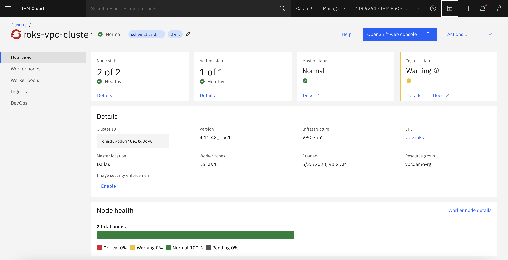 

2. En la consola web, dé click en la esquina superior derecha donde está su nombre de usuario, y seleccione la opción **Copy Login Command** En la pestaña que se abre copie el comando de inicio de sesión, que inicia con las palabras ```oc login```

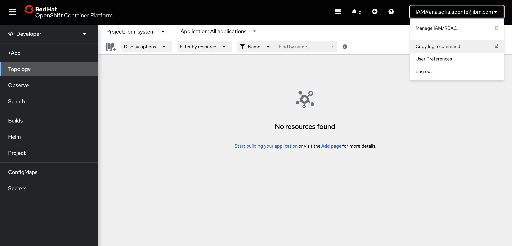 

3. Regrese a la página de inicio de su clúster, allí seleccione la opción **IBM Cloud Shell** en la barra superior. Apenas el shell cargue, ingrese el comando que obtuvo en el paso anterior, así entrará a su clúster desde la terminal.

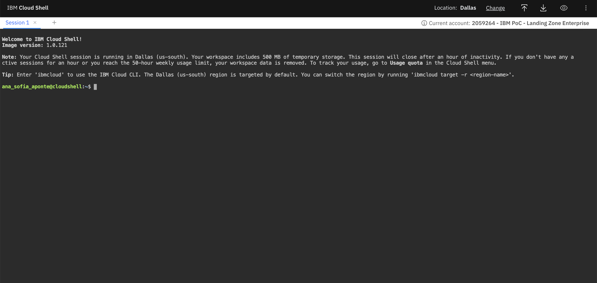 

4. A continuación, se realizará la configuración de los requisitos de Kasten, así como los **Pre-Flight Checks**, para ello ingrese los siguientes comandos:

```
helm repo add kasten https://charts.kasten.io/
```

```
kubectl create namespace kasten-io
```

```
curl https://docs.kasten.io/tools/k10_primer.sh | bash
```

5. Ahora, se instalará Kasten en el clúster, para lo cual debe ingresar el siguiente comando:

```
helm install k10 kasten/k10 --namespace=kasten-io --set scc.create=true --set route.enabled=true --set route.path="/k10" --set auth.tokenAuth.enabled=true
```

6. Cuando finalice la instalación, podrá ingresar al dashboard de Kasten. Regrese a la pestaña donde tiene la consola Web de Openshift, y en el ambiente **Developer** seleccione el proyecto **kasten-io**

 

7. En la pantalla verá todos los componentes de Kasten, incluyendo el gateway, que es el único componente con ruta de acceso. Esto puede distinguirlo porque posee una flecha en la esquina superior derecha. Dé click en el ícono de flecha del gateway para acceder al dashboard de Kasten.

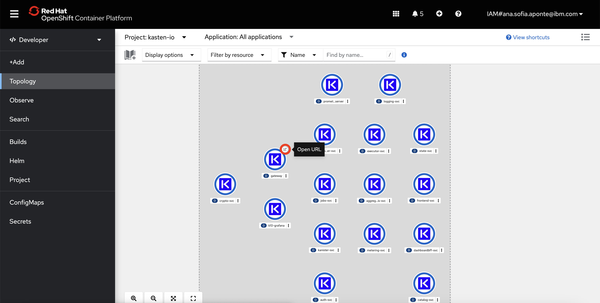 

8. Para acceder al dashboard de Kasten necesitará un token de acceso. Este token lo puede encontrar en la página que abrió en el paso 2 (**Copy login command**), bajo el título de API token.

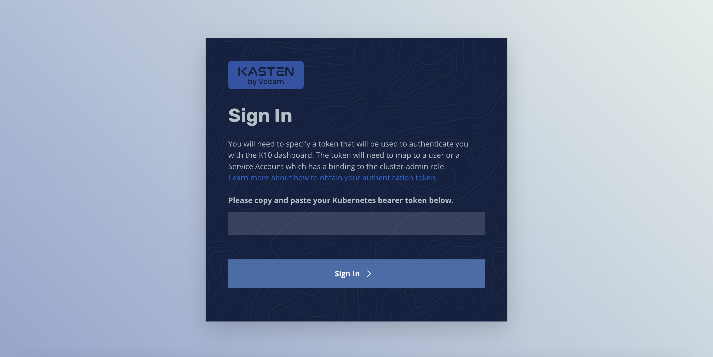 

9. La primera vez que acceda al dashboard se le pedirá aceptar las condiciones del servicio, para ello ingrese los datos que se solicitan.

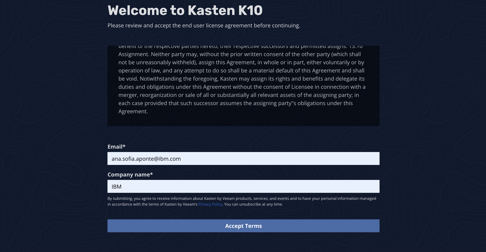 


10. Con esto queda finalizada la instalación de Kasten en Red Hat Openshift.


## Configuración de una Location de IBM Cloud Object Storage :cloud:

Para almacenar los backups que se van a generar se usará una instancia de IBM Cloud Object Storage, que es compatible con S3. 

1. Ingrese a su instancia de IBM Cloud Object Storage, en la pestaña **Service Credentials**. 

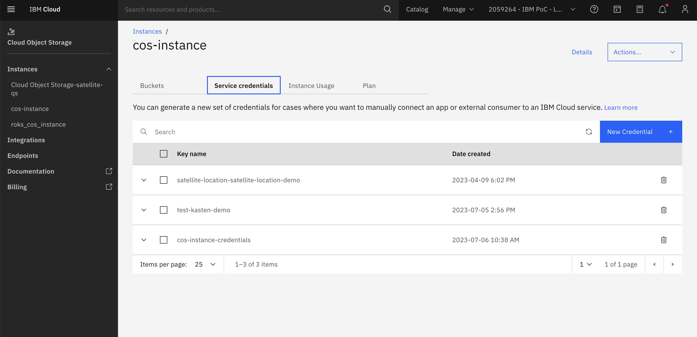 


2. Dé click en **New Credential** y asigne un nombre a las credenciales que está creando. Asigne el rol de **Writer** y habilite la opción de credenciales HMAC. Dé click en **Add**

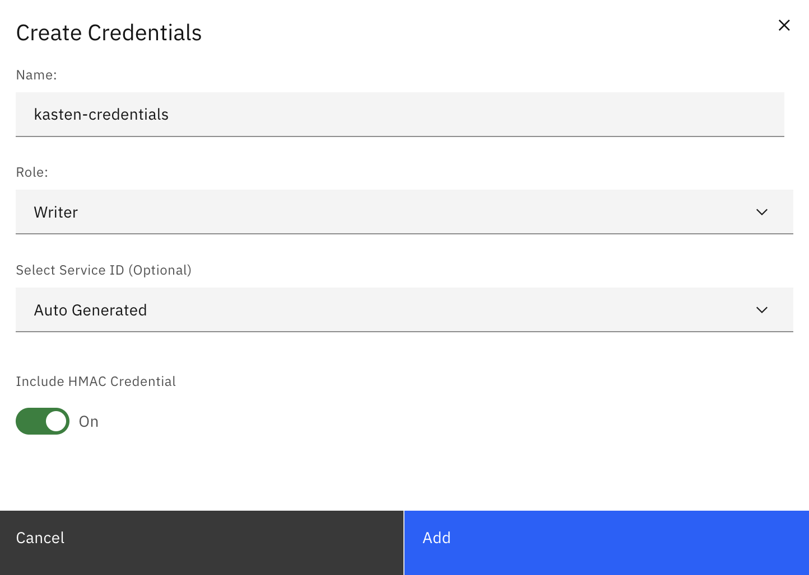 

3. Regrese a la pestaña **Buckets** y dé click en **Create Bucket**. Seleccione **Customize yout bucket**

 

4. Asigne un nombre a su bucket, seleccione la resiliencia regional y la ubicación. Finalmente, Seleccione el tipo de almacenamiento que más se ajuste al uso que hará de los backups. En este caso y como se planea acceder a la data constantemente para pruebas se selecciona la opción **Smart Tier**

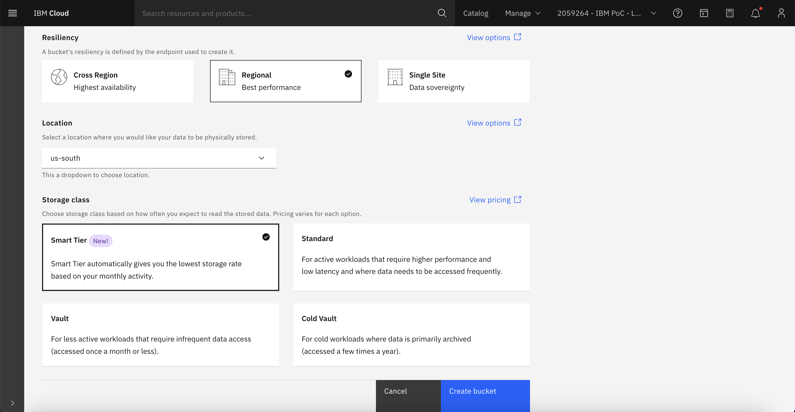 

5. Ya con el bucket de IBM Cloud Object Storage creado, regrese al dashboard de Kasten y seleccione la pestaña **Settings**, opción **Locations > New Profile**

6. Asigne un nombre al perfil de almacenamiento, seleccione la opción **S3 Compatible** y diligencie los campos con la información del bucket y las credenciales HMAC que creó previamente. Dé click en **Save Profile**

 

7. Cuando termine de crear el perfil, deberá ver un recuadro con información de este y el indicador de status **valid**

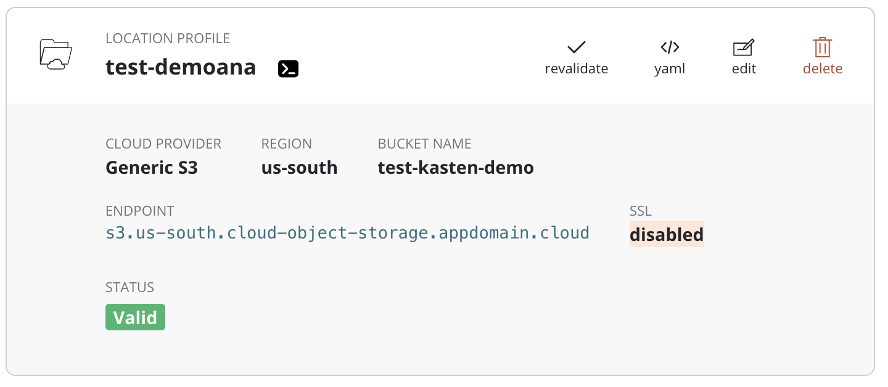 

## Creación y ejecución de una política de Backup :luggage:

1. En el dashboard de Kasten, dé click en la opción **Policies > Create New Policy**


2. Diligencie el formulario de la siguiente forma:
- **Name**: Asigne un nombre para su política de backup
- **Action**: Snapshot
- **Backup Frequency**: Seleccione la frecuencia con la que quiere realizar snapshots, en este caso se selecciona **On Demand**
- **Enable Backups via snapshot exports**: Habilite esta opción y elija el perfil de almacenamiento que se configuró previamente
- **Select Applications**: By Name. Seleccione las aplicaciones a las que desea hacer backup. 
- **Select Application Resources**: All Resources

3. Cuando termine de crear la política, esta aparecerá con el indicador **valid**. Puede dar click en **run once** para realizar el backup manualmente. Si configuró backups automáticos estos se realizarán de acuerdo a la frecuencia seleccionada.

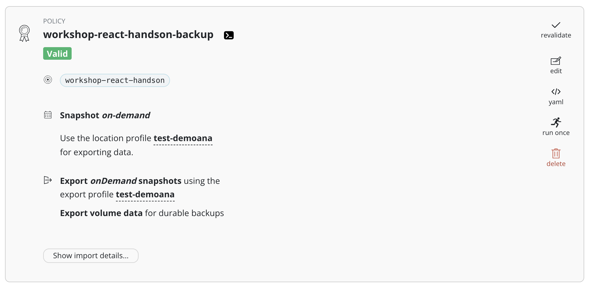 

4. En la parte inferior de la política encontrará un botón que dice **Show import details**, deberá guardar la cadena de texto allí alojada para poder restaurar el backup en un clúster diferente (se realiza en la siguiente sección)


## Restauración de un Backup alojado en IBM Cloud Object Storage :open_file_folder:

1. Ingrese al 

## Referencias :page_facing_up:
- [https://docs.kasten.io/latest/install/requirements.html](https://docs.kasten.io/latest/install/requirements.html)
- [https://docs.kasten.io/latest/install/openshift/helm.html](https://docs.kasten.io/latest/install/openshift/helm.html)
- [https://docs.kasten.io/latest/access/dashboard.html#access-via-openshift-routes](https://docs.kasten.io/latest/access/dashboard.html#access-via-openshift-routes)
- [https://docs.kasten.io/latest/usage/configuration.html#amazon-s3-or-s3-compatible-storage](https://docs.kasten.io/latest/usage/configuration.html#amazon-s3-or-s3-compatible-storage)
- [ https://docs.kasten.io/latest/usage/protect.html#backups]( https://docs.kasten.io/latest/usage/protect.html#backups)
- [https://docs.kasten.io/latest/usage/restore.html](https://docs.kasten.io/latest/usage/restore.html)
- [https://docs.kasten.io/latest/usage/migration.html#importing-applications](https://docs.kasten.io/latest/usage/migration.html#importing-applications)


## Autores :black_nib:
Equipo IBM Cloud Tech Sales Colombia